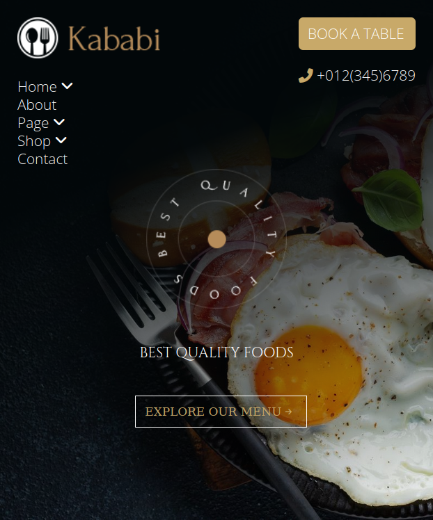
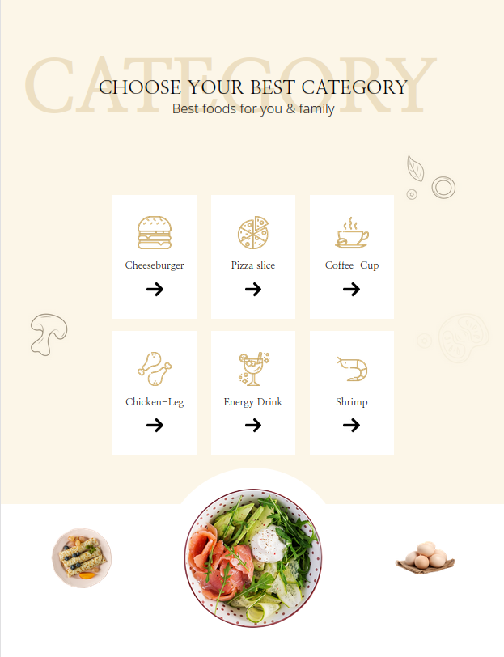

# kabibi-food
Becode exercice : train HTML and css by re-creating a food website

## Briefing
[Instructions](https://github.com/becodeorg/CRL-KELLER-6/blob/main/1.TRAIL/1.The-Field/4.HTML-CSS/2.kababi/readme.md) for the exercise.

## Printscreen

## Used languages
HTML5 and CSS3

## Authors
- Valentin Lefort
- Virginie Dourson

## Date
09/2023

## Progression
WIP

## Link
[Github page](https://vdourson2.github.io/kababi-food/)
